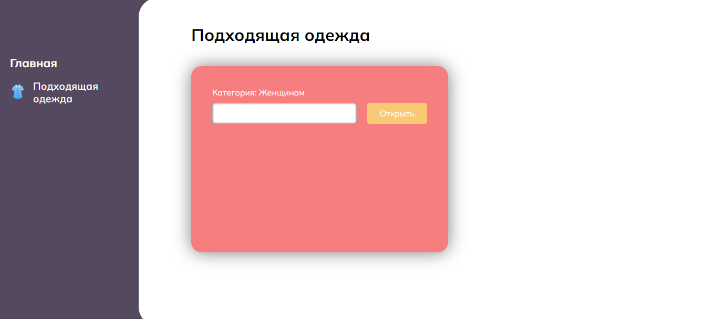
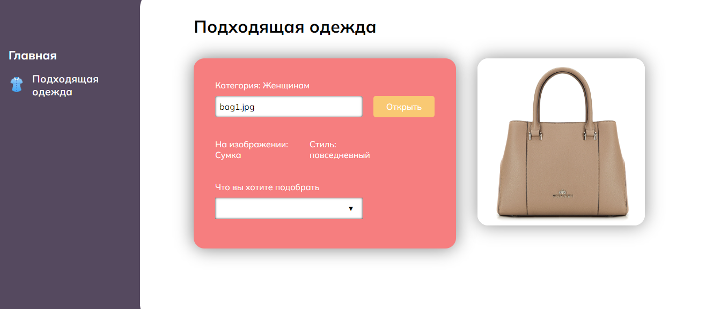
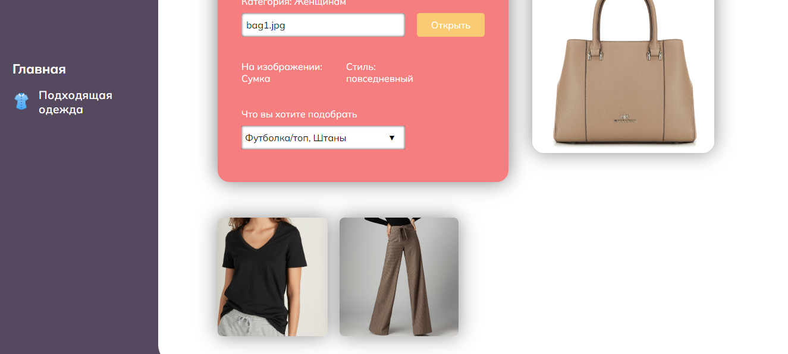

# Clothes

Альфа-версия сервиса для подбора одежды по стилю.

## Как это работает? 
**1. Загрузите изображение своей одежды, нажав кнопку открыть.**

**2. Дождитесь, пока нейросеть определит, какая одежда на изображении и ее стиль.**

**3. Выберите, какой предмет одежды вы хотели бы подобрать.**

## Стек
* Python, Tensorflow, Keras
* Flask
* Docker
* TypeScript, React

## Обучающая выборка
* Fashion MNIST